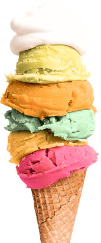

<!--

%list
@extend %list

@mixin bordered($color)
@include bordered(green);

footer: justify-content: space-between;

<svg class="nav-contacts-svg" width="16" height="16">

.contacts__item:not(:first-child) {
  margin-left: var(--gap-header);
}

#{}
/* Стили миксинов */

@include size(200px, 300px);

@include font-source(700, 26px, 1.19, 0.03em, var(--logo-color));

@include indentation(15px, null);

@include centerAuto();

@include centeredFlex();

@include size();

.about-title {
  margin-bottom: var(--gap-header);

  @include font-source(700, 36px, 1.17, 0.03em, var(--header-color));
  text-align: center;
}

.team-social__list {
  @include centeredFlex(content: space-between);
}

@media screen and (min-width: 1280px) {

    }

flex-grow: 1;

white-space:nowrap;

overflow: auto;

overflow: hidden;
 text-shadow: 0px 4px 4px rgba(0, 0, 0, 0.25);
  outline: 2px tomato solid;

  &:hover,
  &:focus {
    box-shadow: 0px 4px 4px rgba(0, 0, 0, 0.25);
  }

   
-->
